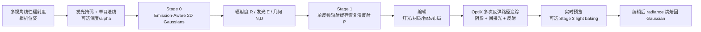

# EAG-PT 实现框架与 Baseline 改进分析

> 分析对象：`2601.23065v2.pdf` 与当前源码提交 `bd7e7524bebf8dd50c908ef922bb4f14fa76092f`。  
> 研究画像：高斯泼溅重光照；重点为质量与解耦；关键词为 3D Gaussian Splatting、relighting、inverse rendering、material-light decomposition、PBR、shadow、specular、global illumination。

## 0. 证据边界与结论等级

- **论文声明**：来自论文正文或附录，页码以 PDF 页码标注。
- **代码确认**：来自本地主仓库源码，可按文件和行号定位。
- **合理推断**：结合论文、代码和渲染/逆渲染常识得到的研究判断，不等同于作者已报告结果。
- 当前工作区没有独立的 `EAG-PT-tracer` 仓库，因此 OptiX CUDA 内核的具体交点、采样器和梯度实现只能依据 Python 调用接口、论文公式和 README 安装说明分析。
- 本次已完成 PDF 全文页级抽取，并视觉复核第 4、6、8、9、13、14 页的方法图、实验表、消融图和局限讨论。

## 1. 一句话结论

EAG-PT 的关键不是把 3DGS 换成另一个网络，而是把“捕获时已经烘焙的辐射场”拆成可追踪的 **发光体 + 非发光表面 + 几何**，然后在统一的 2D Gaussian 表示上做可微 0-bounce/1-bounce 渲染和离线多次反弹路径追踪，最后把编辑后的全局光照重新烘焙回 Gaussian 以获得实时显示。

对你的研究，最值得继承的是这条数据流：



## 2. 论文解决的问题与创新点

### 2.1 问题定义

传统 NeRF/3DGS/2DGS 的颜色或 SH 通常表示捕获条件下的 outgoing radiance。它能拟合原始视图，却把灯光、材质和间接照明混在一起，因此关闭灯、移动灯、换材质或插入物体后不会重新计算阴影和全局光照。论文第 2-3 页将已有方法分为 radiant scene、reflection modeling 和 path tracing 三类，并指出前两类仍依赖原始场景的 radiance cache。

EAG-PT 的目标是：给定带标定相机位姿的室内线性辐射度多视图，重建一个可编辑、可做真实多次反弹的静态场景，并保持细小几何结构，避免网格转换带来的三角化伪影（论文第 2-4 页）。

### 2.2 四个主要增量

1. **Emission-aware decomposition（论文声明）**：在 Gaussian 上增加发光量/发光掩码，显式区分发光组件与非发光几何；相比把所有颜色视为 radiance，能在编辑后重新进行光传输。
2. **Differentiable inverse recovery（论文声明 + 代码确认）**：Stage 0 用可微 2D Gaussian 射线追踪恢复辐射度和几何，Stage 1 用单反弹 Monte Carlo 辐射缓存优化非发光区域的漫反射 albedo。
3. **Physically based multi-bounce editing（论文声明）**：编辑后在 Gaussian 交点上进行多次反弹路径追踪，计算发光、直接/间接漫反射、阴影和互反射，而不是调暗旧 Gaussian 颜色。
4. **Unified 2D Gaussian representation（论文声明）**：同一组 2D Gaussian 同时承担几何、射线交点、材质、发光、路径追踪和 light baking，避免 FIPT 的 mesh + voxel + MLP + image-based shading 多表示组合。

**边界判断**：这些贡献主要是表示与光传输管线的组合创新；论文没有提出新的通用 BRDF、新的全局光照估计理论或新的 OptiX 内核算法。对重光照研究而言，最明确的可发表空白正是论文自己承认的 diffuse-only、emitter mask、采样效率和固定 Gaussian 数量。

## 3. EAG 表示与渲染数学

### 3.1 单个 2D Gaussian

每个 primitive 是嵌入 3D 空间、具有有限平面尺度的椭圆面元：

```text
p       : 3D center
s_u,s_v : in-plane anisotropic scales
q       : quaternion orientation; t_u,t_v,n from q
sigma   : opacity
R       : linear outgoing radiance, RGB
E       : emissive scalar in [0,1]
P       : diffuse albedo, RGB in [0,1]
```

沿射线 `o + t*w` 的面内 Gaussian 权重为论文式 (1)：

```text
g(x) = exp(-0.5 * (((x-p).t_u/s_u)^2 + ((x-p).t_v/s_v)^2))
```

射线按前后顺序对 Gaussian 做 alpha blending。微观量 `v` 可以是法线 `N`、距离 `D`、辐射度 `R`、发光量 `E` 或 albedo `P`，宏观量为：

```text
V = sum_i (T_(i-1) * sigma_i * g_i * v_i)
T_i = product_j<=i (1 - sigma_j*g_j)
```

累积法线和距离分别做归一化；交点使用累积距离得到，后续 bounce 从宏观交点沿估计法线的上半球采样（论文第 4 页，式 (2)-(3)）。

### 3.2 代码中的属性约束

**代码确认**：`libraries/classes.py:1113-1310` 定义 `EmissionAwareGaussians`，PLY 字段为 `positions/scales_0-1/quaternions_0-3/opacities/radiances_0-2/emissives/albedos_0-2`。

**代码确认**：`libraries/classes.py:2452-2585` 使用可逆激活参数化：

- scale、opacity、emissive、albedo：sigmoid，范围 `(0,1)`；
- quaternion：`normalize`；
- radiance：`100 * sigmoid`，线性 RGB 上限约为 100；
- positions：不加激活，直接优化。

这保证了大部分物理量不越界，但没有保证能量守恒、BRDF 互易性或 albedo 与 radiance 的可辨识性。尤其 `E` 是软发光权重，不是严格的物理光源强度；真正发光 radiance 仍在 `R` 中。

## 4. 四阶段实现拆解

### Stage 0：Radiant Scene Reconstruction

**输入**：`transforms.json`、线性辐射度 EXR、相机位姿、初始 `points3d.ply`；可选 emissive mask、normal、depth、alpha 和 synthetic albedo。

**初始化（代码确认）**：`0-radiant-scene-reconstruction.py:17-76` 从点云读取位置和 RGB；scale 初始化为 `0.01`，opacity 为 `0.1`，quaternion 随机归一化，radiance 为 sRGB 转 linear 后的 RGB，emissive 为 `0.1`，albedo 为 `0.2`。

**训练参数（代码确认）**：`LearnableEmissionAwareGaussians.train` 在 `libraries/classes.py:2595-2955` 同时优化位置、scale、quaternion、opacity、radiance、emissive；每个 iteration 随机采一张训练相机，更新前重建 OptiX acceleration structure。

**损失（代码确认）**：`libraries/classes.py:2737-2841`。

```text
L = 1.0 * ((1-lambda_DSSIM)*L1_PQ + lambda_DSSIM*DSSIM_PQ)
    + lambda_E * L_emissive
    + lambda_A * L_alpha
    + lambda_N * L_normal
    + lambda_D * L_depth          (synthetic only)
    + lambda_C * L_normal_consistency
```

默认 `lambda_DSSIM=0.2`、`lambda_A=0.1`、`lambda_E=0.1`；脚本 `0-and-1-reconstruction.sh` 对 Stage 0 设置 normal supervision `0.5` 和 normal consistency `0.05`。normal/depth/consistency 在第 3000 iteration 后才启用，代码默认配置本身是 `0.0`，不能只看 `libraries/configs.py` 判断复现实验权重。

**监督来源**：辐射度在 PQ 域比较；发光量使用 2D mask；法线来自 StableNormal 估计图；synthetic 场景才有 depth 和 albedo GT；alpha 用 alpha EXR 或全 1。

### Stage 1：Diffuse Material Recovery

**入口**：`1-diffuse-material-recovery.py:17-65`。

1. 读取 Stage 0 的 `optimized-2d-gaussians.ply`。
2. 用 `normalize(clamp(radiance, 0.01, 0.99))` 初始化 albedo。
3. 固定几何、radiance 和 emissive，只优化 `parameters_albedos`。
4. 通过 `Differentiable_EAG_OptiX_singlebounce` 调用 OptiX `singlebounce` 与 `singlebounce_backward`（`libraries/classes.py:315-510`）。
5. 每个随机训练视图用 `N_SPP_OPTIMIZE_ALBEDO` 个样本，默认脚本设置为 256，优化 400 iterations。

论文式 (7) 使用 Stage 0 的 incident radiance cache `R(w_i)` 近似入射光：

```text
L_r^1(w_o) ~= 1/n_spp * sum_i R(w_i) * (P/pi) * (w_i . N)
```

材质损失仍是 PQ 域的 `0.8*L1 + 0.2*DSSIM`（论文第 5-6、8 页；代码 `libraries/classes.py:2957-3118`）。当前模型只有 Lambert diffuse `P/pi`，没有 roughness、metallic、specular、transmission 或 environment map。

### Stage 2：编辑与多次反弹路径追踪

**入口**：`editing-and-rendering.py:18-55, 58-997`。通过 `I_SCENE_EDITING_SCENARIO` 分支进行 box/filter/merge、替换 albedo、开关 emissive、插入 lightball/plane、移动物体等编辑。

**代码确认**：

- 0-bounce 输出：`saveNoBounceResultsOnCameras`；
- 1-bounce 输出：1024 SPP；
- path tracing 输出：1024 SPP，`bounce_limit=7`；
- 结果写入 EXR，并计算 PSNR、LPIPS、FLIP；path tracing 后调用 Chaitanya et al. denoiser。

**论文模型**：从当前交点沿余弦加权上半球采样；路径最多 `tau_b` 次 bounce，只有命中 `E > tau_E` 且不超过 bounce limit 时累积 emitter radiance，路径贡献乘以每一跳的 `f * cos / pdf`（论文式 (9)）。这是真正重新计算编辑后光传输的部分。

### Stage 3：Light Baking

**入口**：`light-baking.py:17-72`；脚本 `_scripts/light-baking.sh` 先对编辑后场景的所有 train views 做 1024 SPP、7-bounce path tracing，再把 EXR 作为新的监督图加载到 `path_tracing_radiance_rgb_linear`。

**代码确认**：调用 `LearnableEmissionAwareGaussians.train`，只更新 radiance（脚本将 position/scale/quaternion/opacity/emissive 的学习率置 0），迭代 3000；目标是直接最小化论文式 (10) 的 PQ radiance loss。这样得到的 Gaussian 能用 0-bounce 实时显示，但它是编辑后固定光照的烘焙表示，不能替代重新追踪。

## 5. 数据、划分与实验环境

### 5.1 数据集来源

数据下载入口是 [Hugging Face XijieYang/EAG-PT](https://huggingface.co/datasets/XijieYang/EAG-PT)，目录说明见 `_data/README.md:3-33`。

| 集合 | 场景 | 来源/用途 |
|---|---|---|
| `Blender` | kitchen、livingroom | Blender 合成室内场景；有插入 lightball 的 relighting GT，适合定量重光照。 |
| `Blender-assets` | lightball、plane | 独立编辑资产，先重建再插入其他场景。 |
| `EFT` | emptyroom、furnishedroom、kitchen | VR-NeRF/Eyeful Tower 转换数据，千级 camera-rig views，真实场景编辑。 |
| `FR` | classroom、conference | FIPT 数据重新组织，真实场景与 FIPT 网格基线比较。 |
| `SelfCaptured` | lectureroom 及两种 relighted 条件 | 作者自采集，受控灯光关闭实验。 |

论文第 6 页说明：FIPT 每场景数百视图、360x540；EFT 每场景千级视图并下采样到 540x360；合成 Blender 有插入 lightball 的 relighting ground truth；LectureRoom 有 100 个相机位和 3 种灯光状态。

### 5.2 数据加载与相机划分

**代码确认**：`libraries/classes.py:519-837` 读取 `Radiance-exr`、`Normal-exr`、可选 `Emissive-exr`、synthetic `Depth-exr/DiffCol` 和 `Alpha-exr`；EFT 的 `furnishedroom/emptyroom` 还按文件名过滤部分相机。Blender/FR 默认每 8 张取 1 张测试，其余训练；EFT 用文件名前缀划分 train/test；SelfCaptured 目前 train/test 都使用全部相机。

**重要假设**：输入必须是校准的多视角线性辐射度，不是普通 sRGB。真实采集流程包括 RAW 多曝光合成、镜头/暗角校正、COLMAP 位姿、曝光和白平衡固定（论文附录 C，第 14 页）。

### 5.3 官方复现环境

README 和 `_docs/notes.md` 给出的作者环境：

```text
Ubuntu 22.04
NVIDIA RTX 4090
Driver 570.153.02（notes 中 apt package 为 libnvidia-gl-570）
CUDA / nvcc 12.8
OptiX 7.7
GCC/G++ 11.4
Python 3.11
PyTorch 2.9.0 + torchvision 0.24.0, CUDA 12.8 wheel
```

Python 依赖（README）：

```text
numpy==2.2.6 einops==0.8.1 tqdm==4.67.1
opencv-python-headless==4.12.0.88 OpenImageIO==3.0.4.0
mitsuba==3.7.1 plyfile==1.1.3 open3d==0.19.0
lpips==0.1.4 flip-evaluator==1.7 ninja==1.13.0
```

独立 tracer 安装需要 `TORCH_CUDA_ARCH_LIST=8.9 pip install . -v --no-build-isolation`，并同步修改 tracer 的 `setup.py` 和 `eag_pt_tracer_optix/program/generate-ptx.sh` 中的架构；换 GPU 时必须按 NVIDIA compute capability 替换。

### 5.4 当前机器差距

**代码/环境检查确认**：当前为 Windows PowerShell；Python 3.14.4、conda 26.1.1；`nvidia-smi` 与 `nvcc` 不在 PATH；`EAG-PT/_data/Blender` 和 `_output` 不存在；独立 `EAG-PT-tracer` 不在工作区。因此本次没有执行训练或宣称复现实验成功。建议使用 Linux/WSL2 + NVIDIA passthrough 或作者同类 CUDA 容器，不要直接在当前 Windows/Python 3.14 环境安装。

## 6. 论文结果与可复现基线

论文 Table 1（第 6 页）合成插入发光球的结论：0-bounce 在 original capture 上最好，但 relighted 后失败；1-bounce 有限改善；7-bounce path tracing 达到最高 relighting 质量；light baking 几乎保持 path tracing 指标且时间接近 0-bounce。

论文 Table 2（第 8 页）真实 F-classroom/F-conference：EAG-PT path tracing 的 PSNR/LPIPS/FLIP 均优于 FIPT exported 和 MonoSDF mesh。作者报告 RTX 4090 上 Stage 0+1 约 50-51 分钟，FIPT 约 61-86 分钟；单个 500k Gaussian 的 PLY 约 33 MB，GPU memory 低于 2.5 GB（论文第 8-9 页）。

论文 Table 3（第 9 页）给出关键敏感性：bounce 7->3 明显变暗；1024->256 变糊；4096 提升质量但显著增加时间；缺少 normal supervision、normal consistency、准确 emission mask 或 denoiser 都会损害质量。

### 三档运行路线

1. **最小 baseline**：下载 `Blender.zip` 和 `Blender-assets.zip`；只运行 Stage 0 + Stage 1，验证输出 PLY、0-bounce novel view 和 albedo恢复。
2. **论文主结果**：运行 `_scripts/0-and-1-reconstruction.sh`，再运行 `_scripts/editing-and-rendering.sh` 的 `Blender`/`FR`/`EFT` 场景，固定 1024 SPP 与 7 bounce，记录 PSNR、LPIPS、FLIP 和渲染时间。
3. **重光照改进实验**：以同一 Stage 0 checkpoint、同一 train/test split 和同一编辑场景为控制变量，只替换 Stage 1 BRDF/材质模块或 tracer sampling；同时报告 original、relighted、path tracing、light baking 四类结果。

## 7. Baseline 风险与可验证缺口

| 风险 | 证据 | 对重光照的影响 |
|---|---|---|
| 固定 Gaussian 数量 | 论文第 14-15 页；代码 `LearnableEmissionAwareGaussians` 没有 densify/prune | 细杆/遮挡区域可能欠拟合，过密又增加 ray-Gaussian intersections。 |
| 仅 diffuse albedo | 论文式 (6)-(8)、附录 D 第 14 页 | 金属、白板、高光和玻璃 emitter-reflector 无法解释。 |
| emission mask 依赖阈值/SAM/手工修正 | 附录 B 第 13 页 | 反射亮斑可能被当成灯；错分会污染所有 bounce。 |
| emitter 假设不反射 | 论文第 5、13 页 | 玻璃灯罩、镜面发光体违反模型。 |
| Stage 1 只有单反弹 radiance cache | `libraries/classes.py:2957-3118` | 间接光被近似为固定 incident cache，材质-光照可能互相补偿。 |
| 路径追踪代价高 | 论文 Table 1/3、`savePathTracingResultsOnCameras` | 训练和交互编辑受 1024 SPP、7 bounce 与 denoiser 限制。 |
| 半透明 2D Gaussian 有厚度 | 附录 D 第 14-15 页 | 表面自相交和深度失真会放大阴影/间接光错误。 |
| 线性 HDR 多视角输入门槛高 | 附录 C-D 第 14 页 | 普通手机 sRGB 或曝光不齐时，分解不稳定。 |
| 场景编辑分支硬编码 | `editing-and-rendering.py:69-969` | 不适合大规模 benchmark 或语义级可复用编辑。 |
| tracer 未随主仓库提供 | README 与本地目录检查 | 内核采样、交点梯度和 OptiX 版本兼容性无法仅凭主仓库复现。 |

## 8. 面向质量与解耦的改进建议

优先级按“预期收益 / 改动量 / 实验成本 / 失败风险”排序。前三项建议是最适合直接形成 baseline 改进论文的主线。

### P0-A：从 diffuse-only 扩展到受约束的微表面 BRDF

**目标**：新增 `roughness`、`metallic` 或最小化的 `specular F0`，在保留 Gaussian 表示的同时解释高光和材质-光照耦合。

**实现切入点**：

- `EmissionAwareGaussians` 和 PLY 增加每 Gaussian 的 `roughness`、`metallic`（或 `F0`）字段；
- `LearnableEmissionAwareGaussians` 增加 sigmoid 参数化和独立学习率；
- Stage 1 的 `singlebounce` 接口从 `P/pi` 替换为 Disney/ GGX 微表面项，至少实现 NDF、Smith masking 和 Schlick Fresnel；
- Stage 2 path tracer 同步使用完全相同的 BSDF，避免材质优化模型与最终渲染器不一致；
- 增加 energy conservation、roughness smoothness、specular sparsity 或 metallic prior。

**训练策略**：先冻结 geometry/radiance/emissive，只优化 `P, roughness, F0`；再小学习率联合优化 radiance 与 material。对 emitter-reflector 单独允许 `E > 0` 且 `F0 > 0`，不再强制“发光即不反射”。

**对照实验**：diffuse-only、diffuse+roughness、diffuse+roughness+metallic、oracle material；在 Blender synthetic albedo/roughness GT 上报告 albedo/roughness/metallic MAE、relighted PSNR/LPIPS/FLIP、镜面区域误差和 path tracing time。

**预期失败模式**：单一光照下 roughness/F0 不可辨识；高光被错误吸收到 radiance；GGX 导致低 SPP 方差上升。需要多光照条件或先验正则，不建议一开始同时放开所有 Gaussian 几何参数。

**判断**：论文附录 D 已明确将 Disney BRDF、roughness、metallic 和 refraction 列为未来方向，这是最高相关性的可行扩展。

### P0-B：发光区域的空间正则、颜色/强度解耦与曝光标定

**目标**：减少 emission mask 错分和 `E/R` 的自由度互相补偿。

**实现切入点**：

- 将当前标量 `E` 拆成 `emitter_logit`、RGB `emission_color` 和正值 `emission_intensity`；
- 从 2D mask 投影到 Gaussian 后增加邻域 total variation、connected-component consistency 和 cross-view mask agreement；
- 以 exposure/white-balance latent per view 建模残余曝光差，加入 zero-mean 或校准卡约束；
- 对强反射区域增加“高 radiance 但非 emitter”的 hard negative mask，避免简单阈值分割。

**训练阶段**：Stage 0 前 3k iteration 只优化 geometry/radiance；随后渐进打开 emitter mask loss 和空间正则；对 EFT 仅 1/19 视图有 mask 的设置，使用跨视图一致性传播，不把未标注视图硬设成物理 `E=0`。

**对照实验**：threshold only、threshold+SAM union、空间正则、曝光 latent、完整模型；指标包括 emitter precision/recall/IoU、radiance reconstruction、relighting PSNR/FLIP、灯关闭/开启的阴影误差。

**预期失败模式**：过强 TV 会吞掉细小灯；曝光 latent 会吸收真实光源强度；语义 emitter 与物理 emitter 目标不一致。应报告 mask 质量与最终渲染质量的相关性。

**判断**：论文附录 B 已展示 reflection-brighter-than-emitter、human-defined emitter、emitter-with-reflection 三类例外，说明这是当前 baseline 的实际瓶颈而非泛泛建议。

### P1-A：几何正则与 adaptive densification/pruning

**目标**：减少 2D Gaussian 厚度、自相交、floaters 和固定数量带来的欠/过拟合。

**实现切入点**：

- 加入 2DGS depth distortion、同一像素的 distance monotonicity 和 front/back normal consistency；
- 以 opacity、平均 ray hit count、梯度和重投影残差为依据做 clone/split/prune；
- 每次结构变化后重建 OptiX acceleration structure；
- 对薄结构设置最低 tangent scale，对孤立低 opacity Gaussian 做延迟 pruning。

**实验**：固定 200k/500k/1M 与 adaptive；报告 intersection count、几何 normal/depth error、path tracing time、重光照质量和显存。

**风险**：结构变化破坏 optimizer state；prune emitter 会造成光能丢失；需保存每次 checkpoint 的 Gaussian 数量和随机种子。

### P1-B：多反弹材质优化或神经辐射缓存

**目标**：避免 Stage 1 用固定一次反弹 radiance cache，改善间接光主导场景。

**方案**：在 material recovery 中交替更新 albedo/BRDF 与低 bounce radiance cache；或用 view-independent neural irradiance cache 预测 `L_i`，以 path-traced sparse supervision 校准。

**切入点**：`optimizeAlbedosUsingSingleBounceIntoRadianceCache`、`EAG_OptiX_singlebounce` 和 `savePathTracingResultsOnCameras`；保持最终 path tracer 作为 teacher/evaluator。

**实验**：0/1/2-bounce recovery、固定 cache 与 learned cache；按 indirect/direct 区域分别报告误差，并测每 iteration 的 forward/backward duration。

**风险**：cache 与 albedo 形成更严重的 gauge ambiguity；必须加入多光照、albedo prior 或冻结阶段。

### P1-C：重要性采样、低 SPP 去噪与缓存复用

**目标**：降低 1024 SPP、7 bounce 的训练和编辑成本。

**实现切入点**：OptiX tracer 中加入 emitter importance sampling + cosine sampling 的 MIS；复用静态可见性/BSDF cache；训练时按像素不确定性分配 SPP；light baking 使用 denoised teacher 但保留原始 EXR 评估。

**实验**：uniform/cosine/MIS/emitter-MIS，在 64/256/1024 SPP 下固定 wall-clock 比较 PSNR、LPIPS、FLIP 和阴影误差。

**依据**：论文第 15 页已将 multiple importance sampling、emitter importance sampling 和 LOD 列为主要未来方向；Table 3 证明低 SPP 会显著变糊。

### P2：跨光照联合训练、环境光与真实场景弱监督

- 利用 LectureRoom 三种灯光状态联合估计共享 geometry/material 与条件化 emitter intensity。
- 增加窗户/环境 map，处理真实室内外部光照，而非只建模人工灯。
- 用 HDR/response calibration 放宽线性 HDR 输入要求。
- 用 instance segmentation 替代 `editing-and-rendering.py` 的 box selection，解决物体边界和新暴露区域。

## 9. 建议的第一版改进实验矩阵

| 编号 | Stage 0 | Stage 1 | Path tracer | 目的 |
|---|---|---|---|---|
| B0 | 原始 | diffuse, 256 SPP/400 it | 7 bounce, 1024 SPP | 官方 baseline |
| A1 | 原始 | diffuse + roughness | 同一 diffuse/GGX | 验证材质模型收益 |
| A2 | emitter regularized | diffuse + roughness | emitter-MIS | 分离 mask 与采样收益 |
| A3 | geometry regularized + adaptive | diffuse + roughness | emitter-MIS | 几何/材质/采样联合 |
| A4 | multi-light joint | BRDF + exposure latent | 7 bounce | 解耦可辨识性 |

每个配置至少跑 `b-kitchen`、`b-livingroom`、`f-classroom`、`f-conference` 和 `lectureroom`；报告原始新视角与 relighting 两组结果，避免只在 capture-time 视图上证明颜色拟合。

## 10. 推荐的代码改动顺序

1. 先复制当前 checkpoint 与输出目录，新增 `material_model` 配置开关，确保 `diffuse` 路径完全复现。
2. 在 PLY/schema 和 Python property 中加入 roughness/F0，先实现离线 forward BRDF 单元测试，再接入 `singlebounce`。
3. 用 synthetic Blender 的 albedo/relighting GT 做 Stage 1 小场景实验，先验证材质误差，再放开联合优化。
4. 增加 emitter mask regularizer 和跨视图一致性日志，记录 IoU 与最终 FLIP 的关系。
5. 最后修改独立 tracer 的 MIS/多 bounce 内核；每次内核改动都固定随机种子、SPP、bounce limit 和 Gaussian 数量。
6. 用 light baking 验证改进是否能把高质量 path tracing 转成实时 0-bounce，不能只报告离线 path tracing。

## 11. 复现检查清单

- [ ] Linux/WSL2、CUDA 12.8、OptiX 7.7、PyTorch 2.9/CU128 和 GPU compute capability 已匹配。
- [ ] 主仓库和独立 `EAG-PT-tracer` 提交已记录；不要把 tracer 缺失误判为主仓库 bug。
- [ ] 下载并校验 Hugging Face 数据，目录含 `transforms.json`、`points3d.ply`、`Radiance-exr`、`Normal-exr` 和相应 mask。
- [ ] 先运行 Stage 0，确认 `iter30000-plys/optimized-2d-gaussians.ply` 和 `_records.py`。
- [ ] 再运行 Stage 1，确认 `iter400-plys/optimized-2d-gaussians_iter400.ply`。
- [ ] 编辑场景时记录 `I_SCENE_EDITING_SCENARIO` 与输入 PLY，避免硬编码分支造成不可比。
- [ ] path tracing 固定 `spp=1024`、`bounce_limit=7`，同时保存 noisy、denoised、PSNR、LPIPS、FLIP 和 duration。
- [ ] light baking 使用全部 train views，固定 3000 iterations，并单独报告实时 0-bounce 时间。
- [ ] 每个改进版本保存配置、随机种子、Gaussian count、显存、intersection count 和 wall-clock。

## 12. 最终研究判断

EAG-PT 很适合作为你的 baseline，但应把它定位为“发光感知、漫反射、Gaussian-native path tracing 的物理重光照基线”，而不是完整的 PBR inverse rendering 系统。第一篇改进最稳妥的主线是：**在保持其 emitter decomposition 和多次反弹框架不变的前提下，引入受能量守恒约束的 GGX/Disney 材质，并用多光照/发光正则缓解材质-光照不可辨识性**。同时加入 emitter-MIS 或低方差 radiance cache，才能让质量提升不被 1024 SPP 的成本抵消。

### 参考定位

- 论文方法与公式：PDF 第 2-6 页，尤其第 4 页 Fig.3 和式 (1)-(3)、第 5-6 页式 (4)-(10)。
- 论文实现与结果：PDF 第 6-10 页，Table 1-3、Fig.4、Fig.8-10。
- 论文数据采集与局限：PDF 第 13-15 页，Appendix B-D。
- 源码：`EAG-PT/libraries/classes.py`、`EAG-PT/libraries/configs.py`、`EAG-PT/0-radiant-scene-reconstruction.py`、`EAG-PT/1-diffuse-material-recovery.py`、`EAG-PT/editing-and-rendering.py`、`EAG-PT/light-baking.py`。
